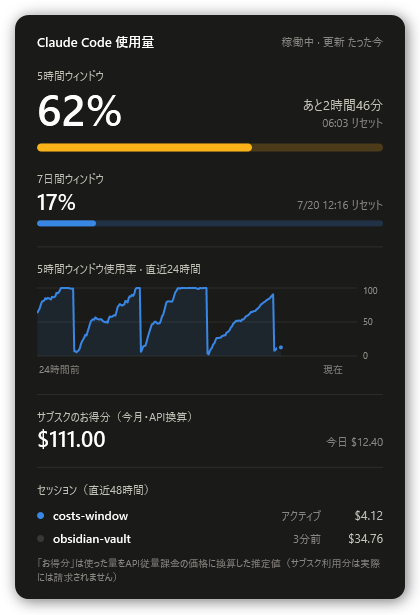

# Claude-Cost-Check

Claude Codeの使用量（5時間枠 / 7日枠）をWindowsのタスクトレイに常駐表示するウィジェット。
トレイアイコンをクリックするとダッシュボードが開く。



**規約完全準拠**: データ源はClaude Code公式のstatusline機能が渡す `rate_limits` のみ。
OAuthトークン・セッションキー・APIポーリング・スクレイピングは一切使わない。
ネットワーク通信ゼロ、認証情報ゼロ。

## 仕組み

```
Claude Code (WSL)
  │ statusline JSON (stdin)          … rate_limits / cost / context_window
  ▼
statusline/statusline.py             … ① ターミナルにstatusline表示（バー付き）
  │                                    ② usage.json をアトミックに書き出し
  │                                    ③ history.jsonl に5分間隔で使用率を記録
  ▼
~/.local/share/claude-usage-widget/{usage.json, history.jsonl}
  │ \\wsl.localhost\<distro>\… 経由でファイル読み取り（5秒間隔）
  ▼
widget/ClaudeUsageWidget.ps1 (Windows) … トレイアイコン＋WPFダッシュボード
```

### トレイアイコン

- 5時間枠の使用率を数字＋深刻度色（青 <50% / 黄 50–79% / 赤 ≥80% / 灰 =セッションなし）＋縁のゲージ弧で表示
- ホバーで5h/7d使用率とリセット時刻のツールチップ
- 5時間枠が80% / 95%を超えたらバルーン通知

### ダッシュボード（トレイアイコン左クリック / ダブルクリック）

- **5時間枠**: 大きな使用率表示＋リセットまでのライブカウントダウン＋深刻度色メーター
- **7日間枠**: 使用率＋リセット日時＋メーター
- **直近24時間の使用率推移**: statusline側が5分間隔で記録した履歴のエリアチャート
- **サブスクのお得分**: 今月/今日の使用量をAPI従量課金の価格に換算した「お得した額」。サブスク利用分と実際のAPI従量課金の実費は**最初から別勘定**で集計され（判定: statusline入力に `rate_limits` が入るのはサブスクのみ）、実費が発生した月だけ「API実費」行が別に表示される
- **セッション一覧（直近48h)**: プロジェクト名・稼働状態・コスト。API従量課金のセッションには「API実費」マーカー
- フォーカスが外れると自動で閉じる（Windowsの音量フライアウトと同じ挙動）
- statuslineはセッション中しか更新されないため、リセット時刻を過ぎた値は「0%（推定）」として表示

### ターミナルのstatusline

```
Fable 5 │ ctx 8% │ 5h ▰▰▰▱▱ 62% →20:40 │ 7d ▰▱▱▱▱ 17% →7/18 21:26
```

視認性のためブロックバー＋太字%表示。コスト（API換算$）は誤解を招きやすいのでstatuslineには出さず、ダッシュボード側に注記付きで表示する。

## セットアップ

### 1. WSL側（収集）

`~/.claude/settings.json` に追記（設定済み）:

```json
{
  "statusLine": {
    "type": "command",
    "command": "python3 /home/harum1020/projects/costs-window/statusline/statusline.py",
    "refreshInterval": 30
  }
}
```

`refreshInterval: 30` により、セッションがアイドルでも30秒ごとに `updated_at` が更新され、
ウィジェット側が「Claude Code稼働中かどうか」を判定できる。

### 2. Windows側（表示）

エクスプローラーで `\\wsl.localhost\Ubuntu\home\harum1020\projects\costs-window\widget` を開き:

- **手動起動**: `ClaudeUsageWidget.ps1` を右クリック →「PowerShellで実行」
  （またはターミナルから `powershell -NoProfile -ExecutionPolicy Bypass -WindowStyle Hidden -File ClaudeUsageWidget.ps1`）
- **自動起動の登録**: `powershell -NoProfile -ExecutionPolicy Bypass -File install-autostart.ps1`
  （解除は `-Uninstall` を付ける）

追加インストール不要（Windows PowerShell 5.1 / .NET Framework標準機能のみ）。

## 動作確認

```bash
# WSL側: 収集スクリプトのテスト
tests/test.sh

# Windows側: GUIなしの疎通確認（WSLから実行可）
cd widget && powershell.exe -NoProfile -ExecutionPolicy Bypass -File ClaudeUsageWidget.ps1 -SelfTest

# Windows側: ダッシュボードを画面に出さずPNGにレンダリング（デザイン確認用）
powershell.exe -NoProfile -ExecutionPolicy Bypass -File ClaudeUsageWidget.ps1 -RenderShot 'C:\path\to\out.png'
```

## usage.json のスキーマ（schema: 1）

```json
{
  "schema": 1,
  "updated_at": 1783940836,
  "updated_by": "<最後に書いたsession_id>",
  "rate_limits": {
    "five_hour":  { "used_percentage": 75, "resets_at": 1783942800, "observed_at": 1783940836 },
    "seven_day":  { "used_percentage": 17, "resets_at": 1784494800, "observed_at": 1783940836 }
  },
  "sessions": {
    "<session_id>": { "updated_at": 0, "model": "", "cost_usd": 0, "context_used_percentage": 0, "cwd": "" }
  }
}
```

- `rate_limits` はアカウント全体の値なので、複数セッション並行時は最後に書いた値が常に最新
- `five_hour` / `seven_day` はstatusline入力で独立に欠落しうるため、欠落時は前回値を保持し
  `observed_at` で観測時刻を区別する
- `sessions` は48時間より古いものを自動で間引く。各セッションの `subscription` は
  rate_limitsを一度でも観測したらtrue（サブスクセッション確定）

### cost-ledger.json（日別コスト台帳）

```json
{
  "schema": 1,
  "sessions": { "<session_id>": { "last_cost": 4.12, "updated_at": 0 } },
  "days": { "2026-07-13": { "subscription": 12.40, "api": 0.50 } }
}
```

- セッションのコストは累積値なので、前回値との**差分**だけをその日の合計に加算（日またぎでも二重計上しない）
- 区分は入力に `rate_limits` が含まれるかで判定（コストが増えるAPI応答後の入力には、サブスクなら必ず同時に含まれる）
- 集計は導入日以降のみ。`days` は400日分保持

## 制約・既知の挙動

- `rate_limits` はPro/Max加入者のみ・セッション初回API応答後に出現
- statuslineはClaude Codeセッション中しか動かない → セッションを閉じると値は止まる
  （ウィジェットは灰色アイコン＋「セッションなし」表示で区別）
- statuslineのJSON仕様が変わったら `statusline/statusline.py` を追従させる
  （仕様: https://code.claude.com/docs/en/statusline.md ）

## 将来の拡張（未着手）

- `~/.claude/projects/**/*.jsonl` のローカル解析による履歴・プロジェクト別コスト集計（ccusage方式・第2段階）
- ウィジェットの見た目強化が必要になったら .NET/WPF or Tauri へ移行（現状のPowerShell版はv0）

## ライセンス

MIT License（[LICENSE](LICENSE) 参照）
